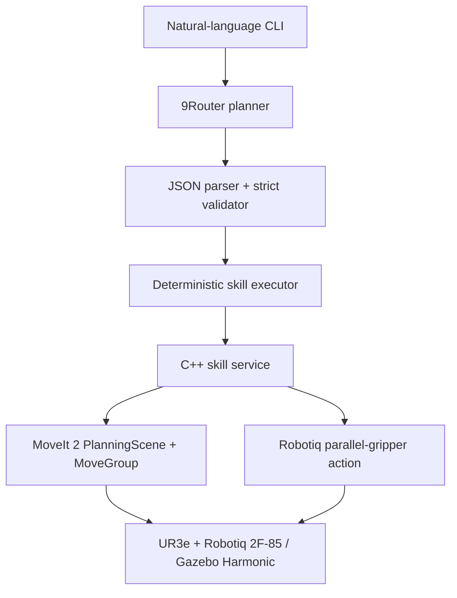

# HRI Assignment 02 — Natural-language UR3e control

This ROS 2 package translates English or Vietnamese commands into a small, validated robot-skill plan and executes it on a simulated UR3e. **The LLM never generates joint trajectories.** MoveIt 2 alone plans and executes arm motion.

## Architecture



The safety boundary accepts only `pick(object)`, `place(object, zone)`, and `home()`, with whitelisted object and zone names. It rejects malformed JSON, extra fields, unsupported skills, arbitrary commands, joint data, and invalid pick/place state before a ROS motion request is sent.

## Tested environment

- Ubuntu 24.04.4 LTS, ROS 2 Jazzy, Gazebo Sim Harmonic 8.11.0
- MoveIt 2 2.12.4, `ur_simulation_gz` 2.5.0, UR3e
- 9Router 0.5.86 and Gemini via 9Router
- Current machine: Node.js 24.21.0 (Node 20 was the compatibility upgrade that first resolved the provider failure)
- Official `robotiq_description` 2F-85 model and UR flange adapter
- Planning group `ur_manipulator`, base `base_link`, end effector `gripper_tcp`
- Arm `joint_trajectory_controller` and Jazzy `parallel_gripper_action_controller`

Assignment 01 remains untouched in the separate `hri_ur3_drawing` repository.

Repository: <https://github.com/VTongg159/hri-assignment-02>

## Package layout

- `ur3_llm_control/`: 9Router client, models, validator, executor, CLI, personalization
- `src/skill_server.cpp`: MoveIt skill implementation and PlanningScene
- `config/scene.yaml`: deterministic scene/motion values
- `worlds/hri_assignment.sdf`: colored cubes, marked zones, and table
- `prompts/task_planner.txt`: constrained LLM system prompt
- `launch/llm_robot.launch.py`: UR simulation, MoveIt, bridge, and skill server
- `test/`: validator, all six ID mappings, and execution-state tests

## Dependencies and build

Create a clean workspace and clone this repository as an independent ROS 2
package:

```bash
mkdir -p ~/hri_ws/src
cd ~/hri_ws/src
git clone https://github.com/VTongg159/hri-assignment-02.git ur3_llm_control

sudo apt update
sudo apt install ros-jazzy-ur-simulation-gz \
  ros-jazzy-ur-moveit-config \
  ros-jazzy-robotiq-description \
  ros-jazzy-parallel-gripper-controller

cd ~/hri_ws
source /opt/ros/jazzy/setup.bash
rosdep install --from-paths src --ignore-src -r -y
colcon build --symlink-install
source install/setup.bash
colcon test --packages-select ur3_llm_control
colcon test-result --verbose
```

No extra pip package is required. Python's standard HTTP client is used. The
released `robotiq_description` package provides the official 2F-85 meshes and
UR flange adapter. If that package is instead built from the upstream Robotiq
source repository, its hardware-only serial driver, hardware tests and TSF
camera-calibration packages are not needed for this Gazebo assignment.

## Student configuration

`config/student_config.yaml` contains student `Nguyen Van Tong`, ID `23020766`. The program calculates `XX=66`, `P=66 mod 6=0`, and prints the resulting A=red, B=yellow, C=blue mapping at startup. The modulo result is not hard-coded.

## 9Router configuration

The client uses the OpenAI-compatible `POST {base_url}/v1/chat/completions` protocol. Copy `.env.example` values into your shell; never commit the real key:

```bash
export NINEROUTER_BASE_URL="http://localhost:20128/v1"
export NINEROUTER_API_KEY="<your 9Router local API key>"
export NINEROUTER_MODEL="gemini/gemini-3.6-flash"
```

Missing credentials, timeout, HTTP failure, and malformed responses fail closed. JSON and streamed SSE responses are supported. `--mode mock` is only for offline development; the final assessment uses the default live `9router` mode.

## Launch and demos

Terminal 1:

```bash
source /opt/ros/jazzy/setup.bash
source /home/admin1/hri_ws/install/setup.bash
ros2 launch ur3_llm_control llm_robot.launch.py
```

Terminal 2, interactive:

```bash
source /opt/ros/jazzy/setup.bash
source /home/admin1/hri_ws/install/setup.bash
ros2 run ur3_llm_control task_cli
```

One-shot basic and advanced examples:

```bash
ros2 run ur3_llm_control task_cli 'Please put the red cube in zone B.'
ros2 run ur3_llm_control task_cli 'Đưa vật màu đỏ sang vùng B.'
ros2 run ur3_llm_control task_cli 'Arrange all objects according to my student ID.'
```

For credential-free parser/UI testing, append `--mode mock`; it does not replace the required live LLM demo.

Restore all cubes and deterministic state between demonstrations with:

```bash
ros2 run ur3_llm_control reset_scene
```

## Robot skills and scene

`pick` moves above a configured cube, opens the 2F-85, descends with `gripper_tcp`, closes the real simulated knuckle/mimic linkage around the cube, attaches the cube in MoveIt, and lifts. `place` approaches a configured zone, descends, opens the fingers, detaches the cube, restores its world collision object, and retreats. `home` uses the local collision-safe SRDF `hri_home` state, which matches the folded simulation startup pose and avoids sweeping the longer gripper through the upper arm. Velocity and acceleration scaling are 0.08, with bounded planning retries and a ten-second planning allowance.

The combined MoveIt model contains the UR3e, official Robotiq links and mesh collisions, a semantic `robotiq_gripper` group, and a `gripper_tcp` at the centre of the fingertip pads. The table and 5 cm cubes remain collision objects in MoveIt. In Gazebo the static cubes are visual-only so they cannot jam the mimic mechanism; after finger closure, a 20 Hz attach/follow abstraction synchronizes the held cube continuously with `gripper_tcp`. The arm and gripper are never teleported.

An occupied destination is refused with `ZONE_OCCUPIED`. The deterministic world-state layer supports an internal `buffer_zone` for permutation cycles; it is never exposed to the LLM.

## Expected output

```text
============================================================
LLM PLAN
============================================================
1. pick(red_cube)
2. place(red_cube, zone_b)
3. home()
...
TASK SUCCESS
```

Invalid output prints `PLAN REJECTED` and sends no skill request.

## Verified runtime results

- Headless Bullet Featherstone simulation on 25 September 2026 loaded all official 2F-85 meshes and activated the arm, joint-state, and parallel-gripper controllers.
- A free-space 0.35 rad close reached 0.330 rad (inside the configured 0.02 rad tolerance), and the final open state was approximately 0 rad.
- Offline mock basic command: red→B completed the validated `pick/place/home` sequence.
- Offline mock personalized task completed all seven skills: red→A, yellow→B and blue→C, with all final positions matching their targets.
- The repository contains 20 passing schema, safety-validation, personalization, state-transition and client-decoding tests.
- Live 9Router execution requires the three environment variables above and must be verified with the selected provider/model in the final demo environment.

## Known limitations

- Gazebo grasp contact is represented by the explicit MoveIt attach/detach abstraction; the official fingers still open and close physically and the held cube follows the TCP continuously.
- Bullet Featherstone is selected because Gazebo's DART backend does not support this URDF mimic-joint setup reliably.
- Scene coordinates are tuned for the UR3e and should be revalidated if the robot/world origin changes.

## Troubleshooting

- Confirm `ROS_DOMAIN_ID=19` if matching the existing laptop setup.
- If motion waits, check `ros2 control list_controllers`, `/joint_trajectory_controller/follow_joint_trajectory`, and `/robotiq_gripper_controller/gripper_cmd`.
- Check `/move_group`, `/execute_skill`, `/joint_states`, and `/planning_scene` with ROS CLI tools.
- If the LLM fails, verify all three environment variables. The client accepts a base URL with or without the final `/v1`.
- The Gemini provider connection failed under the previous incompatible Node.js version. Updating to Node.js 20 resolved it; the final verification machine now reports Node.js 24.21.0.
- Start from a clean terminal and source both Jazzy and the workspace overlay in order.
